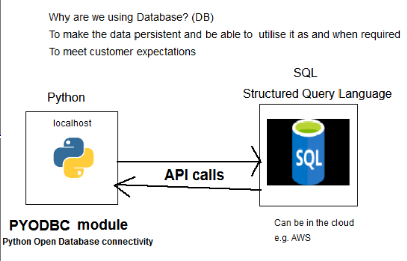

# Python with SQL

## Using PYODBC to connect to SQL from our python program
- Python Open Database Connectivity
- Open source python module that lets us simply access an ODBC database
### What is a Cursor and how to use it
**What is a Cursor?**
- It is a temporary memory station allocated by the DB Server when performing DML operations on a Table

**Implicit Cursors**
- Allocated by SQL server when the user performs DML operations

**Explicit Cursors**
- Created by the user when needed
- Used for fetching data from a table in a row by row manner

#### Using Explicit Cursors
- Syntax for declaring a cursor in SQL
```
DECLARE cursor_name CURSOR
    FOR select_statement_here;
```
- After creating the Cursor we have to open it
```
OPEN cursor_name;
```
- We can then use ```FETCH``` to fetch a row from the cursor and put that information into a variable
- FETCH uses the following 6 methods:
- ```FIRST```  Used to fetch only the first row from the cursor table
- ```LAST```   Used to fetch only the last row from the cursor table
- ```NEXT```   Used to fetch data in a forward direction from the cursor table
- ```PRIOR```  Used to fetch data in a backwards direction from the cursor table
- ```ABSOLUTE n``` Used to fetch the exact nth row from cursor table
- ```RELATIVE n``` Used to fetch the data in an incremental way as well as decremental way
- An example of a using one of these FETCH methods would be
```
FETCH NEXT FROM cursor INTO variable_list;
```
- We can use the ```@@FETCHSTATUS``` function to return the status of the last cursor ```FETCH``` statement executed
 against the cursor. If it returns 0 then the ```FETCH``` statement was successful
- We can use this with a ```WHILE``` loop to ```FETCH``` all the rows from the code
```
WHILE @@FETCH_STATUS = 0
    BEGIN
        FETCH NEXT FROM cursor_name;
    END;
```
- When we're done we can close the cursor
```
CLOSE cursor_name;
```
- And finally we deallocate the cursor
```
DEALLOCATE cursor_name;
```
#### Some functions that we can use to interact with SQL data

## Setting up our pyodbc connection
- Command to install pyodbc
```
pip install pyodbc
```
- Once installed, create a python_sql.py file
- Of course to use our newly installed module we'll have to import it in our file
```
import pyodbc
```
- 
